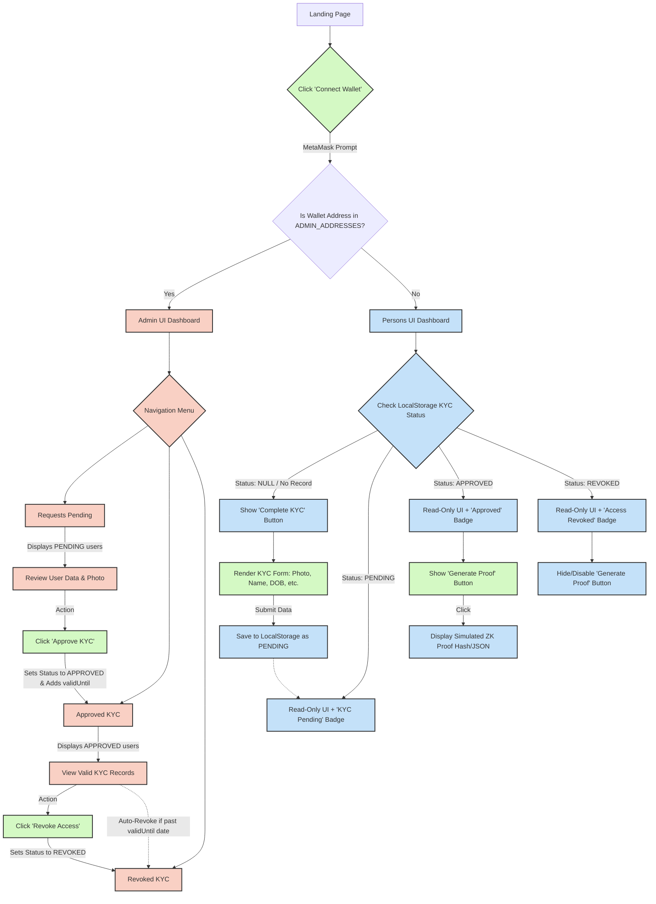

# Web3 KYC Authentication App

A simple, modern Web3 application that allows users to submit KYC (Know Your Customer) data to generate simulated Zero-Knowledge proofs, while designated "Admin" wallets can approve or revoke these requests.

## 🏗️ Architecture Diagram



## 🚀 Getting Started

To get this application running locally on your machine, follow these instructions.

### Prerequisites

You must have the following installed on your system:
- [Node.js](https://nodejs.org/) (v16 or higher recommended)
- A browser with the [MetaMask extension](https://metamask.io/) installed.

### Installation & Run Steps

**1. Install Dependencies**
Navigate to the root directory of this project in your terminal and run:
```bash
npm install
```
*Wait for this command to finish. It reads the `package.json` file and downloads necessary libraries (like React and Ethers.js) into a `node_modules` folder.*

**2. Start the Development Server**
Once the installation is complete, start the application by running:
```bash
npm run dev
```
*This command uses Vite to launch a local development server. It will output a URL in your terminal (usually `http://localhost:5173/`).*

**3. Open the App**
Open your web browser and go to the URL provided in the terminal.

**4. Connect Wallet**
Click the **"Connect MetaMask"** button. Your MetaMask extension will pop up asking which account you want to connect. Select your account to sign in.

### Admin Configuration
To test the "Admin Dashboard", you need to add your MetaMask wallet's public address to the `ADMIN_ADDRESSES` list in `src/context/AppContext.jsx`.

```javascript
export const ADMIN_ADDRESSES = [
  '0xYourWalletAddressHere'.toLowerCase(),
];
```
Once your address is in this list, connecting with that specific wallet will automatically route you to the Admin Dashboard. Any other wallet connected will be treated as a standard "Person".
